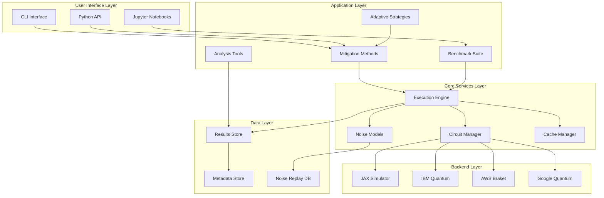
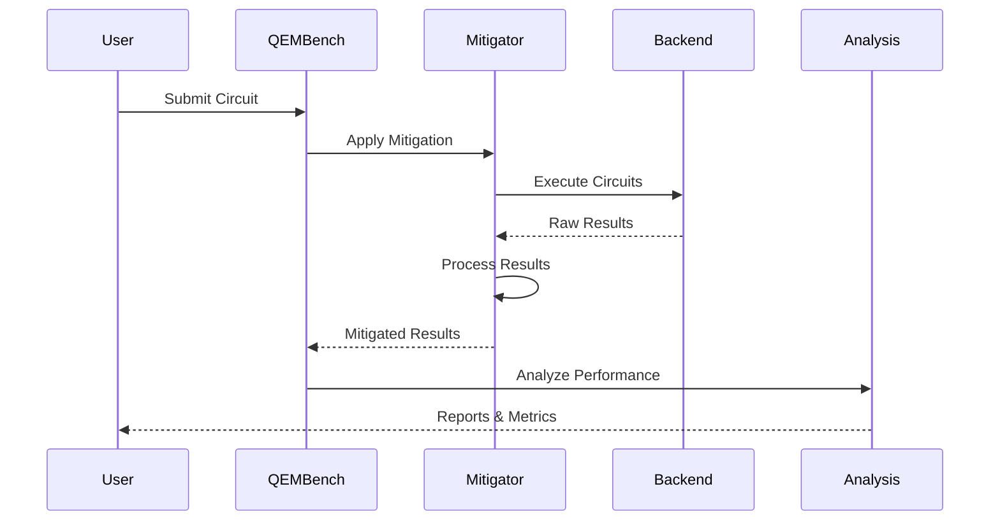

# QEM-Bench Architecture

Comprehensive benchmark suite and JAX implementation for Quantum Error Mitigation techniques.

## System Overview

QEM-Bench is a modular, extensible framework for quantum error mitigation research that provides:
- High-performance JAX-based quantum simulation
- Integration with major quantum hardware platforms
- Standardized benchmarking suite for QEM techniques
- Noise characterization and replay capabilities
- Adaptive mitigation strategies based on device characteristics

## Architecture Principles

### 1. Modularity
- Clean separation between mitigation methods, backends, and analysis tools
- Plugin architecture for adding new techniques
- Dependency injection for backend selection

### 2. Performance
- JAX for GPU/TPU acceleration
- Vectorized operations for batch processing
- Caching strategies for repeated computations
- Lazy evaluation where appropriate

### 3. Reproducibility
- Noise recording and replay system
- Deterministic random seeds
- Version-controlled benchmark definitions
- Comprehensive logging of all parameters

### 4. Extensibility
- Abstract base classes for mitigation methods
- Protocol-based backend interfaces
- Plugin system for custom analysis tools
- Hook-based extension points

## Component Architecture



## Data Flow Architecture



## Module Structure

### Core Modules

#### `qem_bench.mitigation`
- **Purpose**: Implementation of error mitigation techniques
- **Key Classes**:
  - `BaseMitigator`: Abstract base for all mitigation methods
  - `ZeroNoiseExtrapolation`: ZNE implementation
  - `ProbabilisticErrorCancellation`: PEC implementation
  - `VirtualDistillation`: VD implementation
  - `CliffordDataRegression`: CDR implementation

#### `qem_bench.backends`
- **Purpose**: Quantum backend integration
- **Key Classes**:
  - `Backend`: Abstract backend interface
  - `JAXSimulator`: High-performance local simulator
  - `IBMQuantumBackend`: IBM Quantum integration
  - `BraketBackend`: AWS Braket integration
  - `CircuitConverter`: Format conversion utilities

#### `qem_bench.benchmarks`
- **Purpose**: Standardized benchmark circuits and evaluation
- **Key Classes**:
  - `BenchmarkSuite`: Collection of standard tests
  - `CircuitGenerator`: Parameterized circuit creation
  - `MetricsCalculator`: Performance metrics
  - `Leaderboard`: Results tracking and comparison

#### `qem_bench.noise`
- **Purpose**: Noise modeling and characterization
- **Key Classes**:
  - `NoiseModel`: Device noise representation
  - `NoiseProfiler`: Device characterization tools
  - `NoiseRecorder`: Capture real device noise
  - `NoiseReplayer`: Replay recorded noise

#### `qem_bench.analysis`
- **Purpose**: Result analysis and visualization
- **Key Classes**:
  - `ResultAnalyzer`: Statistical analysis
  - `Visualizer`: Plotting and visualization
  - `ReportGenerator`: Automated reporting
  - `PerformanceTracker`: Benchmark tracking

### Service Architecture

#### Circuit Management Service
```python
class CircuitManager:
    def __init__(self, cache_manager: CacheManager):
        self.cache = cache_manager
        self.converters = {}
    
    def register_converter(self, backend_type: str, converter: Converter):
        """Register circuit format converter"""
        
    def prepare_circuit(self, circuit: Circuit, backend: Backend) -> Any:
        """Convert circuit to backend format"""
        
    def optimize_circuit(self, circuit: Circuit, level: int = 2) -> Circuit:
        """Apply circuit optimizations"""
```

#### Execution Engine
```python
class ExecutionEngine:
    def __init__(self, backends: Dict[str, Backend]):
        self.backends = backends
        self.scheduler = JobScheduler()
        
    async def execute_batch(
        self,
        circuits: List[Circuit],
        backend_name: str,
        shots: int = 1024
    ) -> List[Result]:
        """Execute circuits with automatic batching"""
        
    def estimate_runtime(self, circuits: List[Circuit]) -> float:
        """Estimate execution time"""
```

#### Cache Management
```python
class CacheManager:
    def __init__(self, backend: CacheBackend):
        self.backend = backend
        self.ttl = 3600  # 1 hour default
        
    def get_or_compute(
        self,
        key: str,
        compute_fn: Callable,
        ttl: Optional[int] = None
    ) -> Any:
        """Get from cache or compute and store"""
        
    def invalidate_pattern(self, pattern: str):
        """Invalidate cache entries matching pattern"""
```

## Performance Optimization Strategies

### 1. JAX Acceleration
- JIT compilation for hot paths
- Vectorized operations for parallel execution
- XLA optimization for GPU/TPU backends
- Automatic differentiation for gradient-based methods

### 2. Caching Strategy
- Result caching for expensive computations
- Circuit compilation caching
- Noise model caching
- Distributed cache for multi-node setups

### 3. Parallel Execution
- Async/await for I/O operations
- Thread pool for CPU-bound tasks
- Process pool for parallel simulations
- Distributed execution for large workloads

## Security Architecture

### Authentication & Authorization
- API key management for cloud backends
- Role-based access control for shared resources
- Secure credential storage using environment variables
- OAuth2 integration for enterprise deployments

### Data Protection
- Encryption at rest for sensitive data
- TLS for all network communications
- Input validation and sanitization
- Audit logging for compliance

## Deployment Architecture

### Local Development
```yaml
services:
  qem-bench:
    build: .
    volumes:
      - ./data:/data
      - ./configs:/configs
    environment:
      - JAX_PLATFORM_NAME=cpu
```

### Production Deployment
```yaml
services:
  qem-bench:
    image: qem-bench:latest
    deploy:
      replicas: 3
      resources:
        limits:
          cpus: "4"
          memory: 16G
        reservations:
          devices:
            - capabilities: [gpu]
    environment:
      - JAX_PLATFORM_NAME=gpu
      - REDIS_URL=redis://cache:6379
```

## Extension Points

### Custom Mitigation Methods
```python
from qem_bench.mitigation import BaseMitigator

class CustomMitigator(BaseMitigator):
    def mitigate(self, circuit, backend, **kwargs):
        # Implementation
        pass
```

### Custom Backends
```python
from qem_bench.backends import Backend

class CustomBackend(Backend):
    def execute(self, circuit, shots):
        # Implementation
        pass
```

### Analysis Plugins
```python
from qem_bench.analysis import AnalysisPlugin

@register_plugin("custom_metric")
class CustomMetric(AnalysisPlugin):
    def calculate(self, results):
        # Implementation
        pass
```

## Testing Strategy

### Unit Testing
- Test individual components in isolation
- Mock external dependencies
- Property-based testing for mathematical operations
- Parametrized tests for multiple configurations

### Integration Testing
- Test component interactions
- Backend integration tests
- End-to-end workflow tests
- Performance regression tests

### System Testing
- Full benchmark suite execution
- Hardware backend verification
- Load testing for scalability
- Security penetration testing

## Monitoring & Observability

### Metrics Collection
- Prometheus metrics for performance monitoring
- Custom metrics for QEM-specific measurements
- Backend usage and quota tracking
- Error rate and success rate monitoring

### Logging Strategy
- Structured logging with JSON format
- Log levels: DEBUG, INFO, WARNING, ERROR, CRITICAL
- Correlation IDs for request tracing
- Centralized log aggregation

### Distributed Tracing
- OpenTelemetry integration
- Trace circuit execution across backends
- Performance bottleneck identification
- Latency analysis and optimization

## Future Enhancements

### Planned Features
1. **Quantum Machine Learning Integration**: Support for QML workloads
2. **Federated Benchmarking**: Distributed benchmark execution
3. **AutoML for Mitigation**: Automatic method selection
4. **Real-time Adaptation**: Dynamic mitigation based on device state
5. **Quantum Network Support**: Multi-device mitigation strategies

### Research Directions
1. **Novel Mitigation Methods**: Continuous integration of new techniques
2. **Hybrid Classical-Quantum**: Advanced hybrid algorithms
3. **Error Prediction**: ML-based error forecasting
4. **Optimal Compilation**: Mitigation-aware circuit compilation
5. **Cross-platform Portability**: Universal mitigation strategies